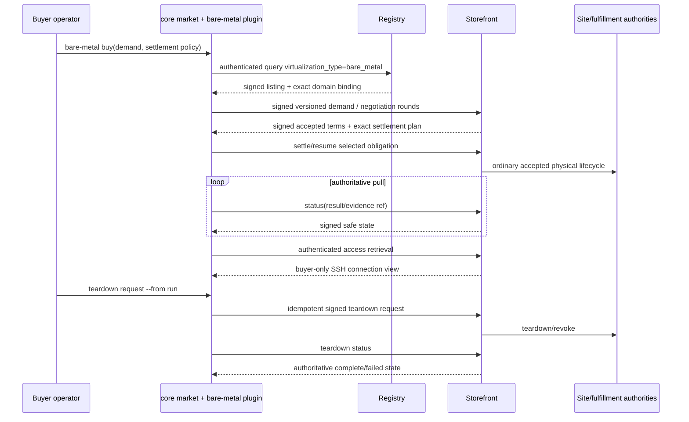

## Context

See `proposal.md` for motivation. The current code establishes several useful seams but not a buyer:

- `core/buyer/src/core_buyer/plugins.py` discovers immutable contracts from `market.buyer_domains`; the core `market` application validates them without importing a concrete market.
- `MarketDomainContract` version 1.0 requires a buyer capability with `register_commands`, `build_provision_terms`, `select_policy`, and `decode_result`, and identifies the resolved-profile injection boundary as `core.resolved-buyer-identity.v1`.
- `core_buyer.orchestration`, `settlement`, `deal_helpers`, `action_policy`, and the version-3 run log own schema-opaque discovery/negotiation/settlement, exact accepted-state loading, transient actions, and fresh-versus-recovery profile resolution.
- VM and API-credit buyer distributions demonstrate entry-point composition, but both retain domain-local orchestration and packaging history that must not be copied wholesale. API credits separates a domain wheel from its buyer wheel; that package split is the closer precedent. The VM wheel's bundled PyInstaller app is not authority to create a second buyer executable.
- `arkhai_bare_metal` currently supplies strict `BareMetalProvisionTerms` (`kind="bare_metal.v1"`, `version=1`, closed SSH payload), listing/message/terms/materialization/receipt models, and a publication-only domain contract. The current storefront rejects buyer-supplied `access_ref`, which is the correct authority boundary.
- The current bare-metal storefront truthfully stops at `fulfillment_available=false`; its stored `BareMetalAccessResult` is an executor-facing shape with an arbitrary `details` field, not an accepted portable buyer result/access contract. A buyer must not build against that shell or read its database/provisioner.
- The multi-domain proposal selects `offer_resource.virtualization_type="bare_metal"` from an immutable offering-mode/domain binding and prohibits domain/site fallback. That accepted field and binding are prerequisites for exact discovery.
- Persistent profiles and expanded hosted funding are active changes. Planning files and checked task boxes are not shipped contracts. The first implementation section therefore proves accepted permanent headings, installed distribution/API versions, producer tests, and integration evidence before buyer code starts.

## Goals / Non-Goals

**Goals:**

- Make bare metal an ordinary independently installed domain contribution to the generic buyer role.
- Keep one canonical run, signer-resolution, settlement-selection, and recovery path instead of another VM-derived implementation.
- Freeze the consumer-side demand, result/evidence, access, and teardown boundaries before implementation.
- Let an Ed25519 hosted-only buyer complete and recover a lease with all wallet/chain settings absent while preserving explicit Alkahest requirements when that mechanism is selected.
- Prove an installed artifact reaches and later loses real whole-host access through authenticated authorities.

**Non-Goals:**

- Designing a replacement seller, fulfillment, evidence, access, or teardown producer API inside the buyer package.
- Importing or moving storefront/provisioning code to make an unavailable producer seam appear local.
- Adding a buyer daemon, callback receiver, direct provisioning client, SSH key generator/agent, or secret vault.
- Adding non-SSH access methods or a new settlement mechanism.
- Preserving an unshipped test helper, loose result dictionary, direct-provisioner path, or standalone bare-metal CLI as compatibility surface.

## Decisions

### 1. Treat prerequisites as an API/evidence gate, not a scheduling suggestion

Before creating the package, implementation records one row for each required seam:

| Required seam | Acceptance needed |
|---|---|
| Buyer identity | Permanent `core.resolved-buyer-identity.v1` and version-3 run recovery requirements; installed core/identity wheels; create/rotate/resume evidence |
| Storefront domain routing | Permanent immutable listing/negotiation domain binding; `offer_resource.virtualization_type`; no domain/site fallback; installed storefront client/domain wheels |
| Bare-metal seller lifecycle | Runnable seller with authority-authenticated agreement status, strict portable result/evidence, buyer-only access, and teardown calls; no `fulfillment_available=false` placeholder |
| Physical lifecycle | POOLS-7 selected-site durable scheduling, fulfillment result/recovery, access revocation, and teardown evidence |
| Settlement | Shared buyer selection/recovery and Alkahest registration; expanded hosted client/adapter, transient actions, and exact funding-profile operation |

Every row names a permanent requirement/architecture heading, installed distribution and public method/version, focused producer test, and integration evidence. A missing column stops all subsequent tasks. If the accepted method or carrier differs from this design, the artifacts are amended first. A buyer-local adapter to an obsolete draft is rejected because it would create two contracts and conceal producer incompleteness.

The buyer and multi-domain changes are source-edit independent, but buyer implementation and full acceptance require the accepted immutable routing/lifecycle producer. This is stricter than merely being able to create the wheel skeleton and prevents a skeleton from being presented as a runnable buyer.

### 2. Use a `src`-layout buyer wheel and the existing core executable

Create:

```text
domains/bare_metal/buyer/
  pyproject.toml
  uv.lock
  Makefile
  src/arkhai_bare_metal_buyer/
    __init__.py
    plugin.py
    cli.py
    demand.py
    listing.py
    negotiation.py
    settlement.py
    lifecycle.py
    presentation.py
  tests/
```

The distribution name is `arkhai-bare-metal-buyer`. Its sole plugin entry is:

```toml
[project.entry-points."market.buyer_domains"]
bare-metal = "arkhai_bare_metal_buyer.plugin:domain"
```

`plugin.py` obtains the installed `arkhai_bare_metal.market_domain()` value and uses `dataclasses.replace` to add `DomainCapability.BUYER` and one `ImmutableBuyerCapability`. It declares `BUYER_IDENTITY_INJECTION_CONTRACT`; command registration is namespaced; provision construction uses `make_bare_metal_provision_terms`; policy selection uses the common configured buyer policy; result decoding uses the accepted strict buyer-safe domain result codec. The module does not mutate the base contract or register at import through global side effects beyond exporting the immutable entry-point object.

The wheel has no console script. `arkhai-core-buyer` owns `market`; installed entry-point metadata makes the command appear. A module-level app may be constructed only in tests from `build_app(domains=[domain])`, not shipped as a competing executable. This differs deliberately from the VM PyInstaller compatibility assembly.

Dependencies are exact public distributions: core buyer/core carrier, `arkhai-bare-metal`, registry/storefront clients, identity/config/policy, and installed settlement registrations/adapters. There is no dependency on `arkhai-bare-metal-storefront`, `market_storefront`, site/resource-pool/fulfillment implementations, compute provisioning service/adapter, another domain buyer, hosted service/Stripe SDK, or tests/e2e. Import-boundary tests include `TYPE_CHECKING` imports and inspect built wheel metadata.

### 3. Register one collision-free command namespace

The plugin contributes:

```text
market bare-metal listing list|show
market bare-metal buy
market bare-metal negotiate
market bare-metal settle --from RUN_ID
market bare-metal status --from RUN_ID
market bare-metal result --from RUN_ID
market bare-metal access --from RUN_ID
market bare-metal teardown request|status --from RUN_ID
```

Generic profile commands remain core-owned. Mechanism-specific setup/status commands remain under the common settlement registration surfaces; the bare-metal namespace does not clone Stripe or Alkahest utilities.

Fresh `buy`/`negotiate` resolve the selected profile once and pass `ResolvedBuyerIdentity` into `BuyConfig.from_resolved_identity`. Every `--from` verb calls `resolve_recovery_buyer_identity(run_id)` before loading accepted state. The plugin never accepts a `--profile`, `--principal`, raw secret, address, wallet, site URL, or provisioner URL override on a recovery command. Command output supports deterministic JSON for safe result/status data; the explicit `access` command is buyer-private and never folds its response into generic status or logs.

A duplicate namespace or incompatible identity/version fails during core assembly. Several installed domains remain valid because only `bare-metal` commands use these hooks.

### 4. Compile exact discovery from the accepted compute-family schema

The listing commands reuse authenticated registry fan-in and filter-spec ETags. They always include the schema-declared predicate `offer_resource.virtualization_type = bare_metal` and validate the returned listing's immutable `bare_metal.v1` domain binding before rendering or negotiation. User resource predicates remain compiled through the registry filter spec; the plugin does not invent aliases or weaken missing-value behavior.

If the registry does not declare the canonical virtualization predicate, the command reports an incompatible prerequisite instead of broad-querying and post-filtering. A returned VM/unknown-domain record, mismatched payload kind, unsigned/untrusted registry result, duplicate listing identity with conflicting contents, or stale filter-spec ETag fails closed. This ensures multi-domain discovery does not rely on payload guessing.

### 5. Keep demand buyer-owned and make SSH input closed

`demand.py` reads a positive `--duration-seconds` and an SSH public-key file (or a single explicit public-key value when allowed by common CLI conventions), parses one OpenSSH `ssh-ed25519` public-key line, validates the base64 key body, and rejects private-key markers, multiline content, blank/unknown algorithms, and options that could alter server-side authorized-key behavior. It then calls the domain-owned `make_bare_metal_provision_terms`; it never constructs a free-form payload.

The buyer can constrain discovery by public listing properties but cannot put site, Resource Pool, Physical Resource, physical-host, machine/executor, price, condition, claimant, expiry, `access_ref`, host/user/port, or provider information in provision terms. The accepted seller terms must echo duration/access/public key and add resource/commercial facts from the selected trusted listing. Buyer verification compares the authority-authenticated listing, original provision envelope, complete principals, selected option, and accepted terms before settlement.

The SSH public key is public method input and may be present in signed negotiation state. Its corresponding private key/path is neither read nor inferred by the marketplace; the user chooses it later when connecting.

### 6. Reuse core negotiation, settlement selection, and run persistence

The buyer supplies thin domain functions to `core_buyer.orchestration` rather than copying VM/API-credit orchestrators. Core owns registry fan-in, aggregation, signed rounds, accepted selection/plan checks, event sequencing, and durable run identity. Domain code owns only:

- bare-metal listing rendering and compatibility;
- provision-term construction and immutable terms checks;
- mapping accepted domain state into the common negotiation/settlement calls;
- strict decoding/presentation of lifecycle carriers.

The common `SettlementPolicy` selects one advertised `SettlementOption` or legacy Alkahest alternative. The run records the selected mechanism, option ID, immutable plan/obligation/operation identities, agreement/negotiation reference, storefront authority, and safe lifecycle references. It does not record current mechanism priority, secrets, hosted payer/instrument data, action URLs, access responses, or raw evidence/provider payloads.

`settle --from` and normal buy servicing dispatch through the shared mechanism registration. Hosted action behavior delegates to `BuyerActionHandler`; URLs exist only in call scope and current state is fetched again after interruption. Alkahest resolution activates its wallet/chain dependency only after the recorded option selects it. There is no fallback or option recomputation on resume.

If the generic orchestration lacks a schema-opaque hook genuinely required by both bare metal and an existing domain, add the narrow hook in `core/buyer` with VM/API-credit regression coverage. Otherwise keep it local; no abstraction is added solely to rename a one-consumer function.

### 7. Freeze separate result/evidence and access contracts

The accepted producer/client must expose authority-authenticated operations addressed by the recorded agreement, not caller-selected URLs or site/provisioner IDs:

- `get_domain_status(agreement_ref)` returns common agreement/settlement/fulfillment state and safe references.
- `get_domain_result(agreement_ref)` returns a strict versioned bare-metal lease result.
- `get_domain_evidence(agreement_ref, evidence_ref)` returns signed portable evidence.
- `get_domain_access(agreement_ref)` returns an authenticated buyer-only SSH access view.
- `request_domain_teardown(agreement_ref, request_id)` and `get_domain_teardown(agreement_ref, teardown_ref)` own idempotent teardown.

Names are semantic; the prerequisite gate records the accepted public client symbols and routes before code starts. The buyer imports that client, never producer implementation models.

The strict lease result/evidence allowlist binds agreement, settlement obligation, fulfillment, Physical Resource, Capacity Reservation/lease, canonical buyer, access method, readiness timestamps, expiry, and opaque evidence/teardown references. It has a closed versioned schema and rejects `details`, credentials, raw executor/provider objects, connection endpoint/user, and unknown keys. The buyer verifies the signed response authority plus all recorded agreement/principal/reference fields before decoding.

The SSH access view is a separate closed carrier with host, port, username, host-key fingerprints, validity, and opaque grant reference. It contains no private key, password, token, provider ID, or arbitrary map. The explicit `access` command may display this view to the authenticated buyer, but never logs or persists the response. A future credential-bearing access method requires a separate change and secret-delivery design; it cannot broaden v1.

Portable evidence may be stored or shared precisely because it is credential-free. The buyer stores at most its stable reference and digest in the run. Evidence signing/hosting belongs to the storefront/condition authority and is a prerequisite, not buyer behavior.

### 8. Route teardown through the storefront and keep it separate from reclaim

A teardown command loads the exact run principal, agreement, authority, and latest safe lease reference. It signs one idempotent storefront request whose request ID is derived/stored for that teardown attempt. The storefront authorizes ownership and coordinates the physical authority. Acceptance records only the opaque teardown reference and state. Exact retry recovers the same operation.

`requested`, `running`, `complete`, `failed/operator_action`, and `already_expired` are distinct. Only authority-authenticated terminal state may be displayed as revoked; a POST acknowledgement is not success. The buyer never marks capacity available and never calls the provisioner. Financial reclaim remains a settlement operation subject to the recorded mechanism; physical teardown after collection does not undo or reclaim payment.

The seller remains responsible for expiry-driven teardown even when the buyer never runs this command. The buyer command is an authenticated request/observation surface, not the lifecycle clock.

### 9. Integrate packaging, install, reinit, and configuration without a parallel stack

`domains/bare_metal/buyer/Makefile` provides `init`, `reinit`, `test`, `build`, and installed-entry-point smoke targets. `reinit` force-upgrades/reinstalls every changed internal wheel from `.dist`, including core buyer/core, bare-metal domain, registry/storefront clients, identity/config/policy, settlement runtime/Alkahest, and hosted adapter/client when selected.

Add `dist-bare-metal-buyer` and focused test targets to `domains/Makefile` and the root `Makefile`; include the wheel in the aggregate wheelhouse, clean installer, review-scope dependency map, and packaging tests. `install.sh` installs the plugin into the environment containing the core `market` script rather than symlinking a new executable. The current VM plugin continues as a peer contribution.

Buyer configuration reuses core registry authorities, selected profile store, action policy, and settlement hierarchy. Bare-metal adds only safe defaults such as duration/access method and an SSH public-key input reference. Generated examples never contain the SSH private-key path/value. Hosted-only examples omit wallet/chains entirely; Alkahest examples declare them through its own section. No compose service, database, or callback port is created for an ephemeral CLI.

E2E additions live under `e2e-tests/src` and `e2e-tests/config`, with staged-wheel installation and normal authenticated service endpoints. They must not make the buyer depend on e2e code.

### 10. Clean cutover leaves no fake buyer or alternate precedence

There is no legitimate production bare-metal buyer today, so there is no run-data migration or compatibility command. During implementation, locate and remove any test script/helper that directly opens seller/provisioner routes or synthesizes a success result as a buyer. Shared producer fixtures may remain only as contract builders/validators and cannot satisfy system acceptance.

Do not add raw `[Identity]`, environment private-key fallback, caller-supplied access reference, current-profile recovery, implicit settlement choice, direct provisioner URL, or loose result decoding for compatibility. Existing VM/API-credit runs and commands are not rewritten; regression proves they continue to use their installed plugins.

## Lifecycle flow



## Risks / Trade-offs

- **Prerequisites continue to move.** The evidence gate and artifact-reconciliation rule prevent implementation against a draft; they may delay coding, which is preferable to a local compatibility adapter.
- **The accepted storefront client may not offer generic lifecycle methods.** Add them in the owning prerequisite/public client, not as HTTP literals in the buyer. This change is amended before implementation if names/shapes differ.
- **Access display is sensitive even without a credential.** Keep it behind an explicit authenticated command, omit it from generic JSON/status/logging, and document operator handling; do not mislabel hostname/username as portable evidence.
- **A public SSH key can still contain surprising syntax.** Version 1 accepts one strict `ssh-ed25519` key and rejects authorized-key options/multiline input, reducing ambiguity at the cost of excluding other algorithms until a later change.
- **No standalone binary may complicate frozen VM deployments.** The release contract is installed wheel entry-point discovery. If a frozen aggregate binary remains supported, its build must intentionally include installed entry-point metadata without making VM own the executable or hard-coding bare metal.
- **Exact installed-artifact E2E is operationally expensive.** It is required because a fake result cannot prove access or revocation; focused tests remain at lower levels for error matrices.

## Migration and rollback

There is no prior buyer database or supported bare-metal buyer run format to migrate. New runs use core run-log version 3 from their first event. Any source-tree/test-only buyer path is deleted at cutover rather than aliased.

Rollout order is: accept and release prerequisites; release the strict bare-metal domain/client contract; build the buyer wheel; install it beside core; smoke entry-point discovery; then enable operator documentation/E2E. Rollback uninstalls or unconfigures only `arkhai-bare-metal-buyer`; it does not mutate seller/site/provisioning state or reinterpret existing accepted leases. An in-flight run remains recoverable only while the exact plugin and dependency versions required by its recorded contract remain installed, so release rollback retains the prior staged wheel set until all such runs are terminal.

## Permanent documentation promotion

At completion, maintain this table as the design-promotion record and replace planned headings with final anchors:

| Accepted decision | Permanent destination |
|---|---|
| Independent buyer wheel, core-owned executable, and dependency direction | `openspec/specs/market-composition/spec.md`, `openspec/specs/market-composition/architecture.md`, `docs/development/ARCHITECTURE.md` |
| Exact bare-metal demand and seller-authoritative resource/terms boundary | `openspec/specs/negotiation-protocol/spec.md` and `architecture.md` |
| Persistent signer use, immutable settlement recovery, safe result/evidence, separate access, and teardown | `openspec/specs/buyer-orchestration/spec.md` and `architecture.md` |
| Wheel, entry-point, installer/reinit, configuration, and wallet-free hosted-only contract | `openspec/specs/deployment-state/spec.md` and `architecture.md`; `docs/development/DEPLOYMENT_AND_CONFIG.md` |
| Shared conformance and real installed whole-host access/revocation evidence | `openspec/specs/test-compatibility/spec.md` and `architecture.md`; `docs/development/TESTING.md` |
| Operator commands, profile/SSH handling, mechanism examples, and recovery | `docs/buyer-quickstart.md` and `docs/bare-metal-buyer-quickstart.md` if the standalone guide remains justified |
| Compute-30 current state and removal/remapping of the missing buyer gap | `docs/development/ROADMAP.md` |
