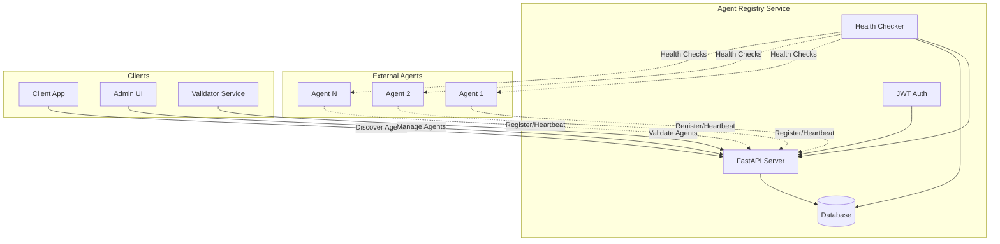
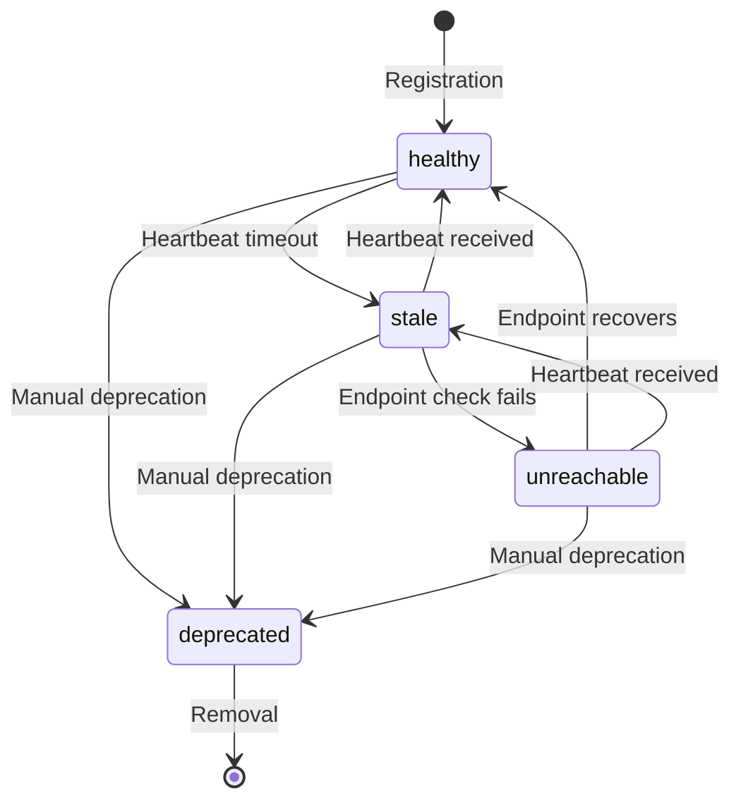
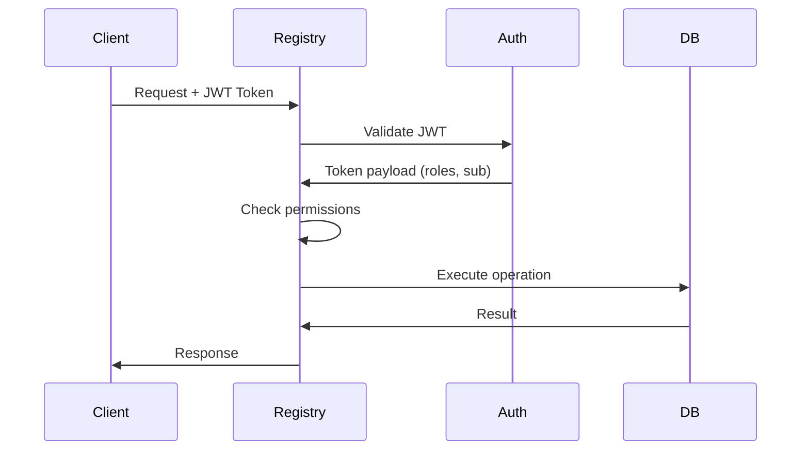
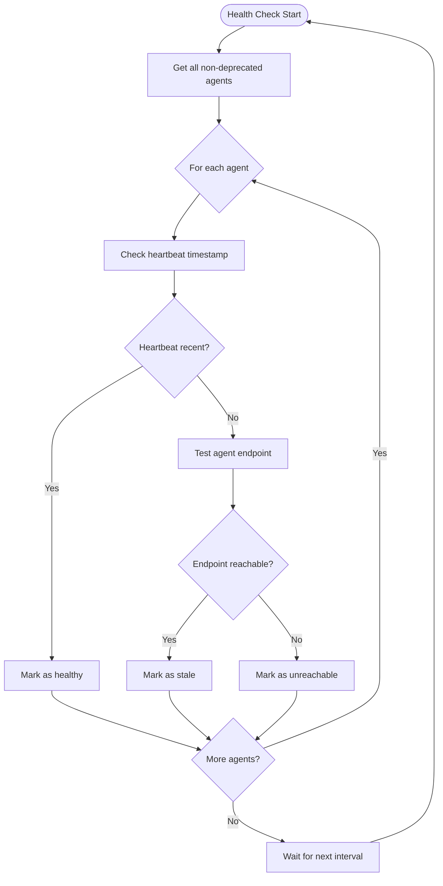
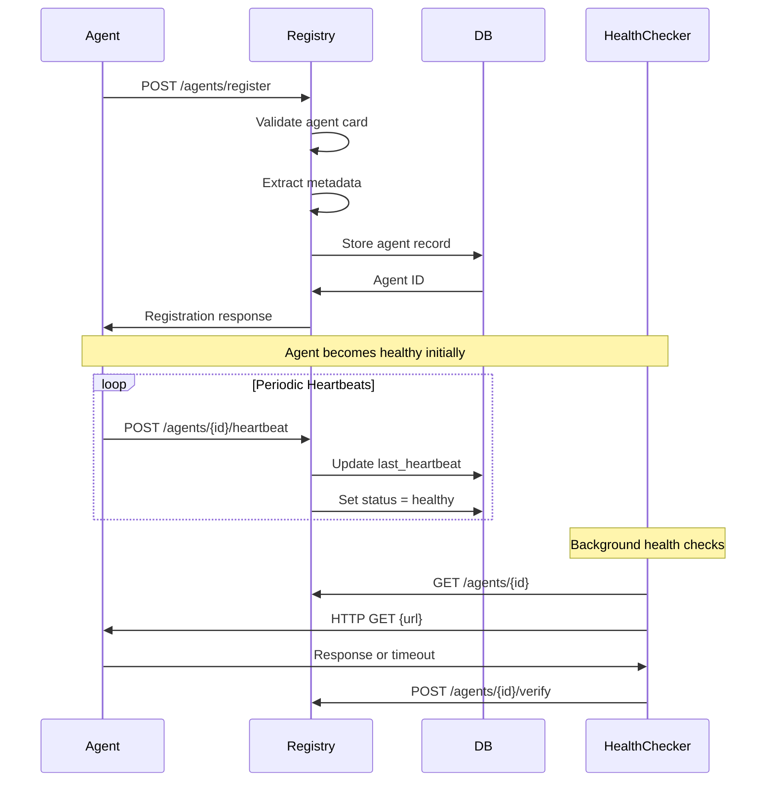
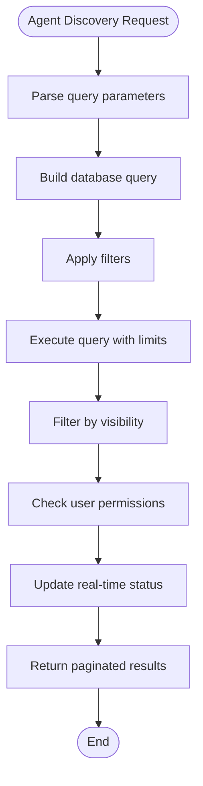

# Agent Registry

A comprehensive FastAPI-based agent registry service for managing, discovering, and monitoring AI agents in a distributed ecosystem. This registry serves as the central hub for agent registration, health monitoring, and discovery with role-based access control.

## Table of Contents

- [Architecture Overview](#architecture-overview)
- [Core Components](#core-components)
- [Setup & Configuration](#setup--configuration)
- [API Endpoints](#api-endpoints)
- [Authentication & Authorization](#authentication--authorization)
- [Health Monitoring](#health-monitoring)
- [Agent Registration Flow](#agent-registration-flow)
- [Agent Discovery](#agent-discovery)
- [Development Guide](#development-guide)

## Architecture Overview

The Agent Registry is designed as a centralized service that manages the lifecycle of AI agents in the ecosystem. It provides a RESTful API for agent registration, discovery, and monitoring with built-in health checking and access control.

### System Architecture



### Core Features

- **Agent Registration**: Dynamic registration of A2A-compatible agents with metadata
- **Health Monitoring**: Automatic health checking via heartbeat and endpoint monitoring
- **Discovery & Search**: Text-based search with filtering capabilities
- **Access Control**: Role-based authentication and authorization
- **Lifecycle Management**: Agent deprecation and status tracking

## Core Components

### Database Schema

The registry uses SQLAlchemy ORM with the following agent model structure:

- **Basic Info**: name, description, version, url
- **Metadata**: domain, owner, visibility, labels
- **Agent Card**: Full A2A agent card in JSON format
- **Status Tracking**: created_at, updated_at, last_heartbeat, status
- **Health Management**: deprecated flag, status enumeration

### Agent Status States



### Health Check System

The registry implements a dual-layer health checking system:

1. **Heartbeat Monitoring**: Agents send periodic heartbeats to indicate liveness
2. **Endpoint Checking**: Background service validates agent endpoint availability

## Setup & Configuration

### Prerequisites

- [uv](https://docs.astral.sh/uv/) for dependency management
- Python 3.8+
- Database (SQLite for development, PostgreSQL/MySQL for production)

### Installation

1. Clone or navigate to the registry directory
2. Install dependencies with uv:

```bash
uv sync
```

### Configuration

The application uses environment variables for configuration. Create a `.env` file:

```bash
# Authentication
JWT_SECRET=your-secure-secret-key-here
JWT_ALG=HS256

# Database
DATABASE_URL=sqlite:///./registry.db

# Health Monitoring
HEARTBEAT_TTL_SECS=60
ENABLE_HEALTH_CHECKS=true
HEALTH_CHECK_INTERVAL=60
ENDPOINT_CHECK_TIMEOUT=10
```

**Important Production Notes:**
- Use a strong, randomly generated JWT_SECRET
- Configure a production-grade database (PostgreSQL recommended)
- Adjust health check intervals based on your agent density

### Running the Server

Start the registry server:

```bash
# Option 1: Using uvicorn directly
uvicorn main:app --reload --port 8080

# Option 2: Using uv to run
uv run uvicorn main:app --reload --port 8080
```

The server will be available at `http://localhost:8080`

## API Endpoints

### Authentication

All endpoints (except health check and token minting) require JWT authentication.

### Agent Management

#### Register Agent
```http
POST /agents/register
Authorization: Bearer <token>
Content-Type: application/json

{
  "agent_card": {
    "name": "Weather Agent",
    "description": "Provides weather information",
    "url": "https://agent.example.com",
    "version": "1.0.0",
    "skills": [...]
  },
  "domain": "weather.example.com",
  "owner": "user-123",
  "visibility": "public",
  "labels": {"category": "weather"}
}
```

#### Get Agent Details
```http
GET /agents/{agent_id}
Authorization: Bearer <token>
```

#### List Agents
```http
GET /agents?q=weather&skill=get_weather&visibility=public&limit=25&offset=0
Authorization: Bearer <token>
```

#### Search Agents
```http
POST /agents/search?q=weather information
Authorization: Bearer <token>
```

#### Send Heartbeat
```http
POST /agents/{agent_id}/heartbeat
Authorization: Bearer <token>
```

#### Deprecate Agent
```http
POST /agents/{agent_id}/deprecate
Authorization: Bearer <token>
Content-Type: application/json

{"deprecated": true}
```

### Health Monitoring

#### Registry Health Check
```http
GET /health
```

#### Verify Specific Agent
```http
POST /agents/{agent_id}/verify
Authorization: Bearer <token>
```

#### Trigger Health Checks
```http
POST /agents/health-checks
Authorization: Bearer <token>
```

### Development

#### Mint JWT Token
```http
POST /dev/mint-token
Content-Type: application/json

{
  "sub": "test-user",
  "roles": ["admin"]
}
```

## Authentication & Authorization

### Role-Based Access Control (RBAC)

The registry implements a comprehensive RBAC system with the following roles:

| Role | Permissions | Use Case |
|------|-------------|----------|
| **admin** | `*` | Full system access |
| **validator** | `validation:score`, `agents:read` | Agent validation services |
| **server** | `agents:register`, `validation:request`, `reputation:authorize`, `agents:read` | Agent registration services |
| **client** | `reputation:give`, `agents:read` | Client applications |
| **viewer** | `agents:read` | Read-only access |

### Authentication Flow



### Visibility Levels

- **public**: Accessible to all authenticated users
- **internal**: Accessible to non-viewer roles (server, client, validator, admin)
- **private**: Accessible only to the agent owner and admins

## Health Monitoring

### Health Check Workflow



### Health Check Configuration

| Environment Variable | Default | Description |
|---------------------|---------|-------------|
| `ENABLE_HEALTH_CHECKS` | `true` | Enable/disable background health checks |
| `HEALTH_CHECK_INTERVAL` | `60` | Health check interval in seconds |
| `ENDPOINT_CHECK_TIMEOUT` | `10` | Endpoint check timeout in seconds |
| `HEARTBEAT_TTL_SECS` | `60` | Heartbeat timeout in seconds |

## Agent Registration Flow

### Registration Process



### Agent Card Schema

The registry accepts A2A-compatible agent cards with the following structure:

```json
{
  "name": "string",
  "description": "string",
  "url": "https://agent.example.com",
  "version": "1.0.0",
  "default_input_modes": ["text/plain"],
  "default_output_modes": ["text/plain"],
  "skills": [
    {
      "id": "skill_id",
      "name": "Skill Name",
      "description": "Skill description",
      "tags": ["tag1", "tag2"],
      "input_modes": ["text/plain"],
      "output_modes": ["text/plain"],
      "examples": ["example query"]
    }
  ],
  "capabilities": {
    "streaming": true,
    "other_capability": true
  }
}
```

## Agent Discovery

### Search and Filtering

The registry provides multiple ways to discover agents:

#### 1. Text Search
Full-text search across agent name, description, and agent card content:

```bash
GET /agents/search?q=weather forecasting
```

#### 2. Agent Listing with Filters
Structured filtering with multiple criteria:

```bash
GET /agents?q=weather&skill=get_weather&visibility=public&limit=10
```

#### 3. Skill-Based Filtering
Filter by specific agent skills or capabilities:

```bash
GET /agents?skill=get_current_time
```

### Discovery Flow



### Search Capabilities

- **Text Search**: Searches across name, description, and agent card JSON
- **Skill Filtering**: Filter by specific skill IDs or tags
- **Visibility Filtering**: Filter by visibility level (public/internal/private)
- **Label Filtering**: Filter by custom labels
- **Pagination**: Limit and offset for large result sets
- **Real-time Status**: Live health status included in results

## Development Guide

### Getting Started

1. **Start the Registry**:
   ```bash
   cd registry
   uv sync
   uv run uvicorn main:app --reload --port 8080
   ```

2. **Get a JWT Token**:
   ```bash
   curl -X POST "http://localhost:8080/dev/mint-token" \
     -H "Content-Type: application/json" \
     -d '{"sub": "dev-user", "roles": ["admin"]}'
   ```

3. **Register an Agent**:
   ```bash
   curl -X POST "http://localhost:8080/agents/register" \
     -H "Authorization: Bearer <token>" \
     -H "Content-Type: application/json" \
     -d '{
       "agent_card": {
         "name": "Test Agent",
         "description": "A test agent for development",
         "url": "https://example.com/agent",
         "version": "1.0.0"
       },
       "visibility": "public"
     }'
   ```

### API Documentation

Once the server is running, visit:
- **Swagger UI**: `http://localhost:8080/docs`
- **ReDoc**: `http://localhost:8080/redoc`

### Testing with Example Agents

The repository includes example A2A-compatible agents in the `/agents/` directory:

- **a2a-agent**: Basic A2A agent with weather and time skills
- **agent-engine-agent**: Agent using the Agent Engine framework
- **agent-engine-a2a-agent**: Combined Agent Engine + A2A agent

These can be used to test the registry's registration and discovery capabilities.

### Production Deployment

For production deployment:

1. **Security**:
   - Use a strong JWT_SECRET
   - Enable HTTPS
   - Configure proper authentication (Auth0, Clerk, etc.)

2. **Database**:
   - Use PostgreSQL or MySQL
   - Configure connection pooling
   - Set up regular backups

3. **Monitoring**:
   - Enable health checks
   - Configure logging
   - Set up metrics collection

4. **Scaling**:
   - Deploy behind a load balancer
   - Consider read replicas for search-heavy workloads
   - Configure appropriate caching

### Troubleshooting

**Common Issues:**

1. **Authentication Errors**:
   - Verify JWT token is valid and not expired
   - Check user has required roles
   - Ensure Authorization header is properly formatted

2. **Database Connection Issues**:
   - Verify DATABASE_URL is correct
   - Check database is running and accessible
   - Ensure proper permissions

3. **Health Check Failures**:
   - Check agent endpoints are accessible
   - Verify firewall rules allow health check traffic
   - Review health check interval settings

4. **Agent Registration Issues**:
   - Validate agent card format
   - Check URL is accessible and returns valid responses
   - Verify required permissions for registration role